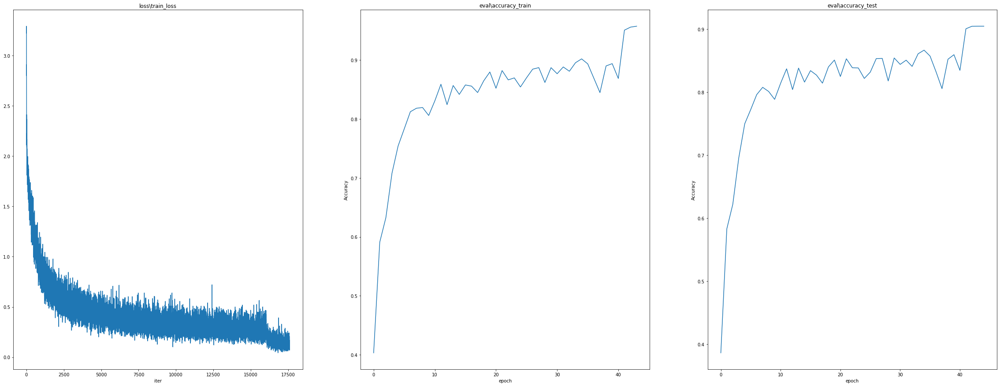
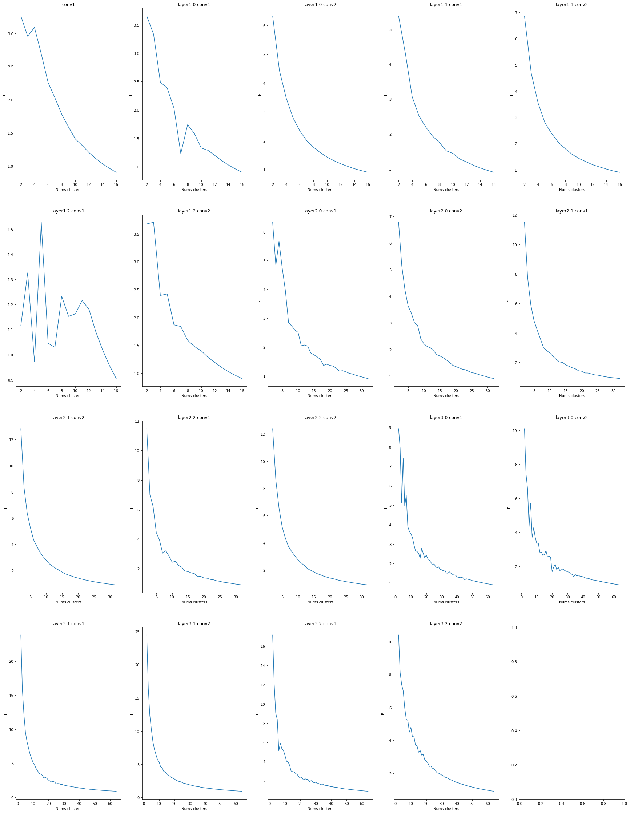
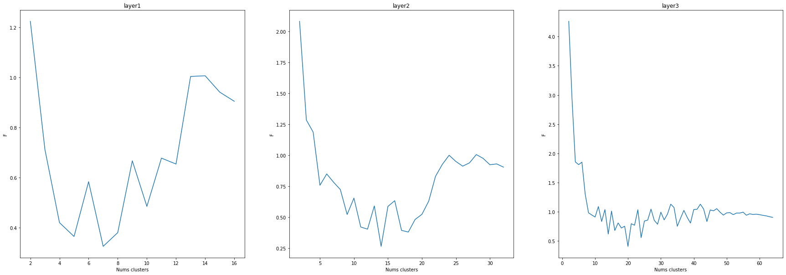
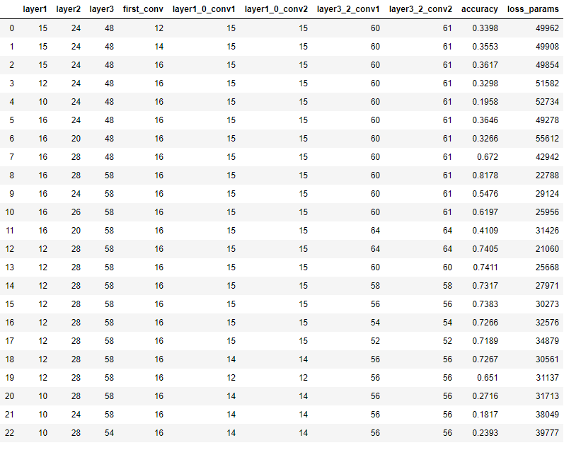
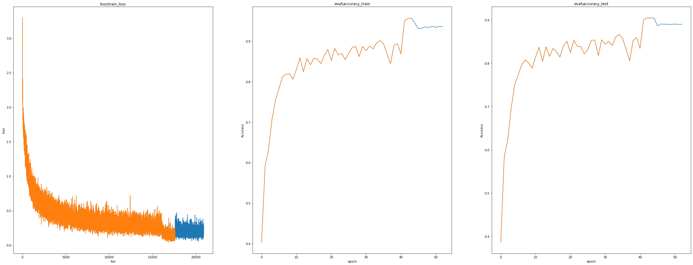
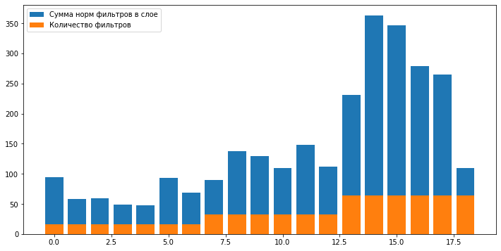

Коды для получения всех результатов приведенных ниже есть в [notebook](https://github.com/kejndan/PruningResNet20/blob/main/extra/results.ipynb)

На данном [сайте](https://app.community.clear.ml/projects/800d5c330efd47c59ee35f31624cc324/experiments/2d1136282547455dbbedc567336d7a93/output/execution) можно посмотреть на интерактивных графика с процесса обучения в разделе Scalars,
а также на Confusion Matrix в разделе Plots
# Точность результатов
На тестовой выборке она достигла: 90.87%

# Реализовать filter-level метод pruning'а.
Для оценки оптимальности количества кластеров будет использовано следующие отношение: F = (unique_params/conv_params)/(accuracy),
где unique_params - это количество уникальных параметров внутри всех центройд, conv_params - это сколько всего параметров
в сверточном фильтре, accuracy - это точность всей сети после замены в данном слое сверточных фильтров на центройды кластеров.
Чем выше данная метрика тем выгоднее обмен количества параметров на точность. Она будет убывать с увеличением количества кластеров
и поэтому нас будут интересовать локальные максимумы. С помощью этой метрики можно найти количество кластеров, при которых
точность упадет не значительно в сравнение с уменьшением количества уникальных параметров, и после чего можно будет дообучить модель, чтобы восполнить потерянную точность.
## Поиск оптимального значения кластеров для каждого слоя

Как можно заметить на некоторых графиках явных локальных максимумов нет, поэтому выбор количества кластеров в данных
сверточных слоях можно сделать основываясь на том, какое соотношения нас устраивает больше всего.
## Использование одинакового количества кластеров для каждого слоя.
В данном эксперименте, я считаю, нужно выполнить деление на блоки на основании количества сверточных фильтров в слоях, 
потому что если для слоя,где 16 сверточных фильтров, 8 кластеров это будет ещё приемлемо, то для слоя, где 64 фильтра,
это будет ужасно. И, так как количество сверточных фильтров может быть 16, 32 и 64, поделим на основании этого количества
эти фильтры на три группы.

Как можно заметить данный эксперимент является более показательным. По первому и второму графику можно сделать вывод,
что разбиение будут очень выгодными с точки зрения уменьшения уникальных параметров на 13 кластеров в случае кластеризации
фильтров в первой группе и в случае разбиения фильтров на 24 кластера во второй группе.

После получения более подробной статистики выводы сделанные на основании графиков подтвердились, в случае работы с первой
группой при разбиении на 13 кластеров точность упадёт на 9% в то время как уникальных параметров станет в 4/5 раза меньше.
А во второй группе при разбиении фильтров на 24 кластера точности падает на 15%, а количество параметров снижается в 3/4 раза.
В случае третий группы, как можно заметить, явно выгодного обмена там нет. Для самого первого сверточного слоя эксперимент не
проводился, потому что он участвовал в предыдущем эксперименте с выбором количества кластеров для каждого слоя и как можно было
заметить он не дал интересных результатов.

## Использование в первых и последних слоя большего числа кластеров, чем в остальных
В данном эксперименте количество кластеров для фильтров сверточных слоёв первой группы за исключением layer1.0.conv1
и layer1.0.conv2 задается одинаковое, для фильтров второй группы количество кластеров одинаковое, а для фильтров третий
группы оно тоже одинаково за исключением двух последних слоёв. В store_exp_3 количество кластеров будет задавать следующим
образом [layer1, layer2, layer3, conv1, layer1.0.conv1, layer1.0.conv2, layer3.2.conv1, layer3.2.conv2].

1) При проведении данного эксперимента было замечено, что количество кластеров в сверточных слоях второй группы тоже должно 
быть достаточно большим(эксперимент 8 и 21). 
2) Количество кластеров в последних двух слоях можно снизить без большой
потери качества (эксперимент 12-17).
3) В первых двух слоях первой группы можно незначительно снизить количество кластеров (эксперимент 17-20)
4) Количество кластеров в слоях третий группы(за исключением двух последних) сильно уменьшать не стоит (эксперимент 22).

## Дообучение модели
Для дообучения была взять модель из эксперимента №17. 
Дообучение позволило повысить точность с 72% до 89%.

Как можно заметить на графиках (оранжевый процесс обычного обучения, синий finetune с замороженными фильтрами свертки),
дообучение позволяет достаточно хорошо поправить ситуацию после прунинга, так как после того как в модели свертки были
заменены на центройды точность на тестовой выборке была около 72%. И также можно сделать вывод, что для finetune необходимо
всего несколько эпох.

# Выявленные проблемы и предложения по их решению
## Замена всех сверточных фильтров сразу.
Проблема состоит в том, что если заменить все сверточных фильтры на центройды их кластеров одним моментов, то уход от отпимальных значений параметров будет слишком большим.

### Решение:
Для каждого слоя процесс прунинга и дообучения проводить отдельно, то есть сначала заменить фильтры на центройды соотвествущих кластеров для первого слоя свертки, заморозить эти фильтры и дообучить, потом подобное проделать со следующим слоем, только уже при дообучении уже фильтры будут заморожены у двух слоёв и так далее. Такая процедура позволит сети постепенно адаптироваться и итоговый результат должен будет получиться лучше, чем если бы фильтры были бы заменены во всех слоях одновременно.

## Вектора, которые представляют сверточные фильтры, будут далеко друг от друга.
При кластеризации может получиться так, что вектор одного сверточного фильтра будет лежать слишком далеко от центройды кластера, к которому он присвоен, при том, что для него это будет самая ближайшая центройда из всех.

### Решение:
1) Увеличить количество кластеров, но не будет гарантии что подобная ситуация изменится или не повториться с другими векторами сверточных фильтров.
2) Добавить пороговое значение, и если евклидово расстояние между центройдом кластера и вектором сверточного фильтроа больше этого порога, то сверточный фильтр не заменяется. Но придется подбирать для каждого слоя отдельное значение порога.
3) Требовать при обучение, чтобы евклидова норма сверточных фильтров была близка к 1. Это решит проблемы с большими расстояниями между векторами сверточных фильтров и позволит перейти к косинусному расстоянию, которое, на мой взгляд, справится в контексте данной задачи лучше с задачей кластеризации и в получение центройды. Но как показано на гистрограмме ниже норма векторов сверточных фильтров далека от 1(чем ближе синий к оранжевому, тем нормированее фильтры в сверточном слое) и поэтому косинусное расстояние использовать не стоит.

   
# Потери важности значения каждого параметра.
При кластеризации значение каждого параметра не очень важно, а важна, в случае евклидова расстояния, их сумма. И в последствии может появить сильная потеря точности при замене фильтра на его центройду. Такая ситуация, к примеру, может возникнуть если вектора сверточных фильтров находятся в противоположных концах кластеров. И замена их обоих на цетройду кластера будет не совсем корректна.

### Решение:
Кластеризовать каждый элемент свертки по отдельности. К примеру, у нас есть 16 сверточных фильтров с 64 параметрами. И вместо того, чтобы провести одну кластеризацию на 10 кластеров 16 векторов длиной 64, мы проведем 64 кластереризации на 10 кластеров 16 векторов длиной 1 и из центройд будут собраны итоговые 10 центройд длины 64. Это позволит при поиске центройды с концетрировать внимание алгоритма только на одной компоненте вектора сверточного фильтра и в теории это должно дать более хороший результат при прунинге. Едиственное данная процедура будет не очень быстрой.